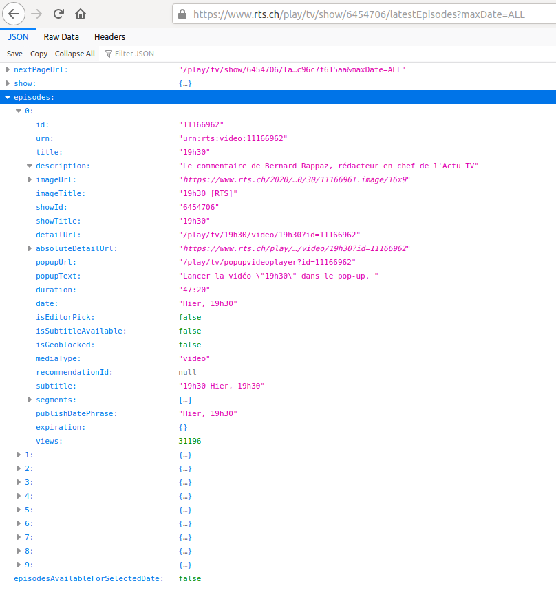
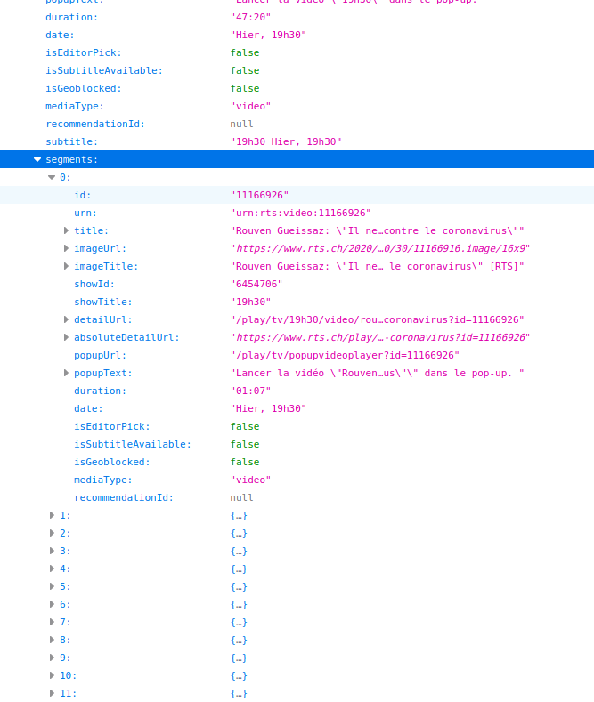
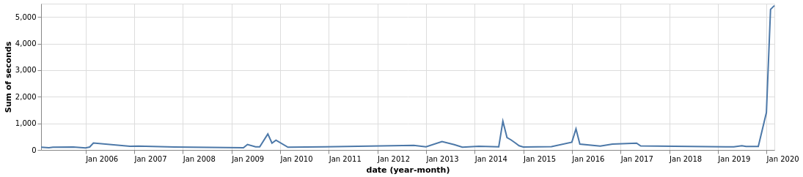

# Titres du 19h30

Comment collecter les titres des sujets du journal de la RTS.

## Trouver la requête

En allant sur la [page du journal du jour (le 15 Mars 2020)](https://www.rts.ch/play/tv/emission/19h30?id=6454706), nous observons les requêtes que fait le navigateur (dans firefox `ctrl-shift-k` et l'onglet `network`).

La requête suivante semble intéressante:

[https://www.rts.ch/play/tv/show/6454706/latestEpisodes?maxDate=ALL](https://www.rts.ch/play/tv/show/6454706/latestEpisodes?maxDate=ALL)

En ouvrant l'URL dans un autre onglet du navigateur, nous voyons qu'elle retourne les 10 derniers épisodes du "19h30".



Et chaque épisode contient une séries de `segments`, les sujets du jour.



Essayons de changer la partie `maxDate`:

[https://www.rts.ch/play/tv/show/6454706/latestEpisodes?maxDate=2020-01-01](https://www.rts.ch/play/tv/show/6454706/latestEpisodes?maxDate=2020-01-01)

Il semble que cette requête nous permet de revenir dans le temps. À chaque `maxDate` nous pouvons obtenir les 10 derniers épisodes du "19h30".

## Télécharger les données

Nous allons utiliser la requête pour chercher les 10 derniers épisodes, puis les 10 derniers épisodes d'il y a 10 jours et ainsi de suite.

### Créer les dates `maxDate`

Pour manipuler les dates, nous allons utiliser la librairies [dayjs](https://github.com/iamkun/dayjs).

```
npm install dayjs --save
```

Une fonction pour trouver la prochaine date. 10 jours avant la précèdante:

```js
const getNextMaxDate = maxDate =>
  (maxDate === 'ALL' ? dayjs() : dayjs(maxDate, 'YYYY-MM-DD'))
    .subtract(10, 'day')
    .format('YYYY-MM-DD')
```

Si `maxDate` est `ALL` (la première requête), nous prenons la date du jour (`dayjs()`). Si `maxDate` est une date au format `YYYY-MM-DD`, nous la passons à `dayjs` (`dayjs(maxDate, 'YYYY-MM-DD')`). Une fois que nous avons la date au format `dayjs`, nous pouvons y soustraire 10 jours (`.subtract(10, 'day')`) et la retourner au format souhaité (`.format('YYYY-MM-DD')`).

### Télécharger les derniers épisodes

Pour télécharger les données, nous utilisons `node-fetch`.

```
npm install node-fetch --save
```

Une fonction qui prends `maxDate`, fait la requête et lis la réponse au format `json`:

```js
const getLatestEpisodes = maxDate =>
  fetch(`https://www.rts.ch/play/tv/show/6454706/latestEpisodes?maxDate=${date}`)
    .then(r => r.json())
```

### Sauver les données

Une fois les données obtenues, nous devont les sauver quelque part. Il est possible que notre scripte retourne une erreur tôt ou tard. Si nous gardons les résultat en mémoire pour créer un fichier à la fin, nous risquons de tout perdre en cas d'erreur. Il vaut mieux sauver les données à chaque fois que nous les obtenons.

Nous allons sauver les données dans un fichier [`ndjson`](http://ndjson.org/), (new line delimited json), c'est à dire un fichier où chaque ligne représente un objet `json`. À chaque fois que nous recevons des données du serveur de la RTS, nous ajouterons une ligne à ce fichier.

Nous utiliserons la librairie `fs`. Celle-ci est déjà installée avec `nodejs`. Nous avons déjà utilisé les fonctions `readFile` et `writeFile` de `fs` pour respectivement lire et écrire un fichier entier. Cette fois nous souhaitons pouvoir ajouter une ligne à la fois à un fichier. Nous utiliserons la fonction [`createWriteStream`](https://nodejs.org/en/knowledge/advanced/streams/how-to-use-fs-create-write-stream/)

```js
const file = fs.createWriteStream('latest.ndjson')

const saveLatest = latest =>
  file.write(`${JSON.stringify(latest)}\n`)
```

`file` est le fichier où nous sauvons les données. Il s'appellera `latest.ndjson`. La fonction `saveLatest` prends un objet json (`latest`) et le converti en chaîne de charactère (`JSON.stringify`) et reviens à la ligne `\n`.

### Une boucle pour répèter l'opération

Nous avons ce qu'il nous faut pour télécharger les données pour une certaine date et pour sauver le résultat. Nous devons maintenant créer une boucle qui répète l'oprération pour chaque nouvelle date.

#### Un example de boucle

Pour illustrer à quoi va ressembler notre boucle:

```js
const loop = (number, callback) => {
  if (number === 10) {
    return callback()
  }
  console.log(number)
  loop(number + 1, callback)
}
```

Dans cet example la fonction `loop` prends deux arguments: `number` (n'importe quel nombre) et `callback` (la fonction à appeller une fois la boucle terminée). Si `number` est égal à 10, nous appellons `callback`. Sinon nous loggons `number` et appellons `loop` à nouveau en incrémentant `number` de 1 (`loop(number + 1, callback)`).

Si nous lançons la boucle avec un `number` de 1:

```js
loop(1, () => console.log('done'))
```

`1` va être loggé, `loop` va être appellé avec `2`, `2` va être loggé, `loop` va être appellé avec `3`... et ainsi de suite jusqu'à ce que `loop` est appellé avec `10`. À ce moment là, la fonction `callback` va être appellée. Dans notre cas, `done` va être loggé puisque notre `callback` est `() => console.log('done')`.

#### La boucle finale

Nous souhaitons continuer jusqu'à l'an 2000 si possible. Une fonction pour décider quand il est temps d'arrêter:

```js
const loopShouldEnd = maxDate => {
  if (maxDate === 'ALL') { return false }
  return dayjs(maxDate, 'YYYY-MM-DD').isBefore('2000-01-01', 'YYYY-MM-DD')
}
```

Si `maxDate` est `ALL` (le premier tour), continuons. Si `maxDate` est avant `2000-01-01` arrêtons, sinon continuons.

La boucle:

```js
const loop = (maxDate, callback) => {
  if (loopShouldEnd(maxDate)) {
    // appeller callback si c'est le moment d'arrêter
    return callback()
  }
  // récupèrer les épisodes
  getLatestEpisodes(maxDate)
    .then(latest => {
      // sauver les épisodes
      saveLatest(latest)
      // si "episodes" est vide arrêter la boucle
      if (R.propOr([], 'episodes', latest).length === 0) {
        return callback()
      }
      // générer la prochaine date
      const nextMaxDate = getNextMaxDate(maxDate)
      // logger pour savoir où nous en sommes
      console.log(nextMaxDate)
      // appeller loop avec la nouvelle date
      // pour être gentil avec la RTS et pour ne pas se faire banir de leur serveur
      // attendons 1 seconde (1000 millisecondes) avant de continuer la boucle
      setTimeout(() => {
        loop(nextMaxDate, callback)
      }, 1000)
    })
    // arrêtre la boucle s'il y a une erreur
    .catch(callback)
}
```

Lancer la boucle avec la première valeur (`ALL`). `callback` est une fonction qui prends un argument `err`. S'il y a une erreur, loggons-la, sinon loggons `done`.

```js
loop('ALL', err => console.log(err || 'done'))
```

Le script entier est `scripts/getLatest.js`, nous pouvons le lancer avec:

```
node scripts/getLatest.js
```

Le serveur de la RTS a répondu avec une erreur autour de noël 2004. Nous n'avons pas pu aller jusqu'à l'an 2000. Nous avons néanmoins 15 ans de titres du 19h30 dans `latest.ndjson`.

## Sortir les épisodes

Chaque ligne de `latest.ndjson` contient 10 épisodes. Nous souhaitons avoir un fichier `ndjson` avec un épisode par ligne.

### Lire un fichier ligne par ligne

`scripts/getEpisodes.js`

Pour lire le fichier `latest.ndjson`, nous utilisons la librairie [`readline`](https://nodejs.org/api/readline.html#readline_readline_createinterface_options). Comme `fs`, celle-ci vient avec `node`, nous n'avons pas besoin de l'installer.

```js
const reader = readline.createInterface({
  input: process.stdin,
})

reader.on('line', line => {
  console.log(line)
})
```

La constante `reader` est un lecteur ligne par ligne qui prends tout texte venant de la console en entrée (`{ input: process.stdin }`). Avec `reader.on` nous pouvons écouter les événements sur le lecteur. Dans ce cas quand une ligne est lue, nous la loggons.

Dans les cours précèdants nous avons pris le texte de la console et l'avons sauver dans un fichier avec `>`. Par exemple pour sauver la requête des derniers épisodes du 19h30.

```
curl https://www.rts.ch/play/tv/show/6454706/latestEpisodes?maxDate=ALL > latest_19h30.json
```

Avec `<` nous pouvons faire l'inverse et passer un fichier à la console.

```
node scripts/getEpisodes < latest.ndjson
```

Le fichier `latest.ndjson` est passé à notre scripte qui le lit ligne par ligne et log une ligne quand elle est lue.

Chaque ligne est une chaîne de charactères puisque c'est ainsi que nous l'avons sauvée en utilisant `JSON.stringify` plus haut. Nous pouvons convertir une ligne en `json` avec `JSON.parse`.

```js
reader.on('line', line => {
  console.log(JSON.parse(line))
})
```

Nous avons maintenant accès à chaque ligne dans le scripte en tant qu'objet javascript.

Comme nous avons vu en analysant la réponse du serveur de la RTS, les épisodes sont sous la clé `episodes`. Plutôt que logger chaque ligne, nous pouvons logger chaque `episode`.

```js
reader.on('line', line => {
  const json = JSON.parse(line)
  json.episodes.map(episode => console.log(episode))
})
```

Si nous souhaitons sauver les épisodes dans un nouveau fichier, nous pouvons utiliser `>` pour sauver ce qui sort de la console dans un nouveau fichier. Mais avant cela nous devons transformer chaque épisode en chaîne de charactères avec `JSON.stringify`.

```js
reader.on('line', line => {
  const json = JSON.parse(line)
  json.episodes.map(episode => console.log(JSON.stringify(episode)))
})
```

```
node scripts/getEpisodes < latest.ndjson > example_episodes.ndjson
```

`latest.ndjson` est passé au scripte `getEpisodes` qui passe chaque épisode à la console qui à son tour les passe à `example_episodes.ndjson`.

`example_episodes.ndjson` n'est pas le fichier final. Nous allons profiter du fait d'avoir accès aux épisodes pour les transformer, n'en garder que les parties qui nous intéressent.

Pour chaque épisode nous souhaitons avoir:

* `episode_id` l'identifiant unique de l'épisode
* `date` la date de diffusion au format `YYYY-MM-DD`
* `duration` la durée de l'épisode en secondes
* `views` le nombre de vues
* `segments` les sujets traités. Pour chaque `segment`:
  - `segment_id` l'identifiant unique du `segment`
  - `title` le titre du sujet
  - `duration` la durée du sujet en secondes

Revenons à [https://www.rts.ch/play/tv/show/6454706/latestEpisodes?maxDate=ALL](https://www.rts.ch/play/tv/show/6454706/latestEpisodes?maxDate=ALL) pour voir à quoi ressemblent les épisodes.

### La date

Les dates peuvent avoir différents formats:
  - `Hier, 19h30`
  - `samedi, 19h30` (pour la semaine passée)
  - `06.03.2020, 19h30` (pour les épisodes plus anciens)

Les `date`s des derniers jours ne sont pas très utiles en tant que telles mais la clé `imageUrl` semble contenir la date, par example `https://www.rts.ch/2020/03/14/20/34/11165246.image/16x9/`.

```js
const getDateFromImageUrl = imageUrl => {
  const [protocol, x, url, year, month, day] = imageUrl.split('/')
  return `${year}-${month}-${day}`
}

const getDate = ({ date, imageUrl }) => {
  const [day] = date.split(',')
  const [ d, m, y ] = day.split('.')
  if (!d || !m || !y) { return getDateFromImageUrl(imageUrl) }
  return `${y}-${m}-${d}`
}
```

La fonction `getDate` prends un épisode pour argument (avec les clés `date` et `imageUrl`), nous enlevons la partie `, 19h30` en séparant la chaîne de charactères au niveau de la virgule et en en prenant la première partie (`const [day] = date.split(',')`). Nous séparons cette dernière par `.` pour avoir les jours (`d`), mois (`m`) et années (`y`) (`const [ d, m, y ] = day.split('.')`). S'il manque un des trois, nous devons aller chercher la date dans `imageUrl`. Sinon nous retournons la date au format `YYYY-MM-DD`. La fonction `getDateFromImageUrl` récupère la date à partir de `imageUrl` en la séparant par `/`.

### Les durées

Les durées des `episodes` et `segments` est au format `28:32`.

```js
const durationInSeconds = duration => {
  const [m, s] = duration.split(':')
  return Number(m) * 60 + Number(s)
}
```

`durationInSeconds` transforme la durée du format RTS en secondes.

### Les `segments`

Pour chaque `segment`, nous allons chercher `segment_id`, `title` et `duration`:

```js
const parseSegment = segment => ({
  segment_id: segment.id,
  title: segment.title,
  duration: durationInSeconds(segment.duration),
})
```

### Les `episodes`

Pour chaque `episode`, nous prenons `episode_id`, `date`, `duration`, `segments` et `views`:

```js
const parseEpisode = episode => ({
  episode_id: episode.id,
  date: getDate(episode),
  duration: durationInSeconds(episode.duration),
  segments: episode.segments.map(parseSegment),
  views: episode.views,
})
```

### Lire chaque ligne

```js
reader.on('line', line => {
  const json = JSON.parse(line)
  json.episodes.map(R.pipe(
    parseEpisode,
    JSON.stringify,
    console.log
  ))
})
```

De chaque ligne, nous tirons tous les épisodes `json.episodes.map`. Nous transformons chaque épisode avec `parseEpisode`, le convertissons en chaîne de charctères avec `JSON.stringify` et le loggons avec `console.log`. `R.pipe` est la fonction [ramda](https://ramdajs.com/docs/#pipe) qui permet d'appliquer plusieurs fonctions à la suite.

```
npm install ramda --save
```

Sans utiliser `pipe`, nous pourrions écrire cette fonction comme ceci:

```js
reader.on('line', line => {
  const json = JSON.parse(line)
  json.episodes.map(episode =>
    console.log(
      JSON.stringify(
        parseEpisode(episode)
      )
    )
  )
})
```

La commande

```
node scripts/getEpisodes < latest.ndjson > episodes.ndjson
```

**Mise à jour**

En utilisant les données je me suis rendu compte que nous avons certains doublons. Aucun jeu de données n'est parfait. Pour être certain d'avoir une liste unique d'épisodes:

```
node scripts/getEpisodes < latest.ndjson | sort -u > episodes.ndjson
```

J'ai ajouté `| sort -u` avant de passer les lignes au fichier. `|` est l'équivalent de `pipe` pour la console. `sort -u` permet de ne faire passer que les lignes uniques

crée un fichier `episodes.ndjson`.

## Un fichier avec tous les sujets

Chaque ligne de `episodes.ndjson` est un épisode du 19h30, nous allons créer un fichier `segments.ndjson` avec tous les sujets traités. Comme avec `getEpisodes`, nous allons lire le fichier ligne par ligne et en extraire ce qui nous intéresse.

Pour chaque sujet (`segment` pour utiliser l'appellation de l'API de la RTS), nous aurons besoin de `episode_id` pour pouvoir le lier à un épisode, `position` (dans quelle position le `segment` a été diffuser) et la `date`.

`scripts/getSegments.js`

```js
const readline = require('readline')
const R = require('ramda')

const reader = readline.createInterface({
  input: process.stdin,
})

reader.on('line', line => {
  const episode = JSON.parse(line)
  const { episode_id, date } = episode
  episode.segments.map(R.pipe(
    (d, i) => ({ ...d, position: i + 1 }),
    R.mergeRight({ episode_id, date }),
    JSON.stringify,
    console.log
  ))
})
```

Le lecteur `reader` est le même que tout à l'heure. À chaque ligne nous allons prendre `episode_id` et `date` de l'épisode (`const { episode_id, date } = episode`). Pour chaque segment (`episode.segments.map`), nous allons ajouter la `position` qui est l'indexe du segment plus 1 pour que le premier titre ait une `position` de 1 plutôt que 0 (`(d, i) => ({ ...d, position: i + 1 })`). Nous ajoutons `episode_id` et `date` avec la fonction ramda [`mergeRight`](https://ramdajs.com/docs/#mergeRight) (`R.mergeRight({ episode_id, date })`), transformons l'objet en chaîne de charactères (`JSON.stringify`) et loggons (`console.log`).

La commande

```
node scripts/getSegments < episodes.ndjson | sort -u > segments.ndjson
```

crée un fichier `segments.ndjson`

## Utiliser les données

Pour pouvoir utiliser les données, il nous faut séléctionner les données que nous souhaitons de `episodes.ndjson` ou `segments.ndjson` et les transformer en fichier `.json`.

`scripts/searchTemplate.js`

```js
const readline = require('readline')

const reader = readline.createInterface({
  input: process.stdin,
})

const result = []

reader.on('line', line => {
  const json = JSON.parse(line)
  // ajouter une ligne à "result" si elle satisfait une condition
  if (/* LA CONDITION */) {
    result.push(json)
  }
})

reader.on('close', () => {
  // utiliser les lignes collectées plus haut
  // préparer les données
  console.log(JSON.stringify( /* VOS_DONNEES */ ))
})
```

Plutôt que de passer les données à la console avec `console.log`, nous collectons les lignes qui nous intéresse dans un tableau `result`. Quand toutes les lignes du fichier on été lues, l'événement `close` est appellé. Nous pouvons transformer les données séléctionnées et envoyer le résultat à la console pour créer un fichier avec les données qui nous intéressent.

### Example 1: le temps consacré au mot "virus"

`scripts/searchVirus.js`

```js
const readline = require('readline')
const R = require('ramda')

const reader = readline.createInterface({
  input: process.stdin,
})

const result = []

reader.on('line', line => {
  const json = JSON.parse(line)
  // prenons le titre en lettres minuscules
  const title = json.title.toLowerCase()
  // si le titre inclus le mot "virus"
  if (title.includes('virus')) {
    // ajouter au résultat final
    result.push(json)
  }
})

reader.on('close', () => {
  // les jours où "virus" a été utilisé
  const uniqDays = R.uniq(result.map(R.prop('date')))
  // pour chaque jour nous calculons la somme des secondes
  const data = uniqDays.map(date => ({
    date,
    seconds: R.sum(
      result
        .filter(R.propEq('date', date))
        .map(R.prop('duration'))
    )
  }))
  console.log(JSON.stringify(data))
})
```
La commande:

```
node scripts/searchVirus < segments.ndjson > temps_consacre_aux_virus.json
```

Un graphique avec le temps consacré par mois créé avec [vega-lite](https://vega.github.io/editor/#/url/vega-lite/N4KABGBEAkDODGALApgWwIaQFxUQFzwAdYsB6UgN2QHN0A6agSz0QFcAjOxge1IRQyUa6ALQAbZskoAWOgCtY3AHaQANOCgATZAgBOjQnh4qckACppiYeMtjp4ugJdh0rMKm54wFRrtawwQnRdMDFkMABGAE5EAGYABjBtUPQwACUzAGU6NQ1ITXQ8TBxgKAp0MVYdbDAAbWB8wuRsSAAmeOiReNiRCOk1SFhkGyVNWGwIvoBfVQaCvGasNo6oroBWLoA2AaGRsYnp2caFlvbO+IB2EVa1neHlfawItYuZuabTla6ADl6Lu724yerW+b2Oi2WnUmvSiAIeQIiCTB8wh7XaXQivQicNGCNiryOKM+6I612xqkG91xE2krWRHyWaPiGOusRxjz6oMJDOWJMxrX6FN28ImsSi9JOjPifOu2yFVMeNzWEtR0uZpJB7KBAoJ70lvPVmISWomrV14OJhpEsXJlMB2FaiJVlq6rVdJuBm2dUpJbu6Hoi8XF3P1TNd6wDm2DetVvq6-3l9qwCS5MZd0p+HtaUWVIdj6rdiI9sW+dLz6cLgrtIuBubTPoLvTl1epWEd0YtDfDEW+xek0m9BvDjo9UQ7RK7GdarQD0gig7DU7ZiZrYtTnaHU6rwtbsTW8QXauHtxXrekSPLk7drWbO8e0nidY3i+vCZbiouZfrm+vvdPioiL1Lx-a5YX-IFviic0J03HoOgDMdDxJOCZ3A7A5wPYDFzg5d321b55ywo9ui6bcFSBfEnxg7CIzQrA1kQojkPjYsGKQ9U4L-PDsE2WIgO-Gigw9NY1gHJiON6eIs0-diuh6SYPSjTCBOI+TUO4+iomU59VN6XC7yBaRNi-HTH27Mik0DfjTI2eJpD0j1vms6j4jMszogDbpDyDSTSIDM1vNWQNZQQ5yeXaHzoXiLiDNNKjwtcoL+TfWKngvFTIsLW1Ur46CEp8y4yQDQDAp+By6MmPLQ0S3zjTos1x3yq5oRHCqnSIgr7LNRyTJcgqNgidTUsGsSMtWMzp0c7S+oG9Vb3Ig5pvyzYWXieakwuUbTJWrdPMa6q1rkjFiqWg6drg9aaz6fbVUOwbaI0xEbs+QqpykirpHi6rgpIm5PNO1Vgvu+CKvaQ97qBy7WwiC5CJUxEWU1NqqsBuDZuLdr4c4zN6tc8H5OZbNPLC777KnFKFrSknAbJq4bX8gHPj6MrpWLC51xc5nopxx7DnhsnfkGrNYl6hKud+brkfBgXrXejSBThnSufGobKcDLbObJ8aT0ei5qaZrWWIq74vpp3yhIq2INbF+zgsm0GOZt3yb2K-WpWZ6FAwDfFpaxIrLcVzXej9KGORecHbP5HXhqDCOWeytXWlicGdv5VXLNElOWXpy3He+na-X0tWomt-PwzWvtRbLjNAKzNY3chc6HtS9ss+5l2PqrwGVs9sD5aT8Grnc6PE+ToiYfWJtvcDsWh5WpHHukcUAF1wBmPIMF0ABrGpIAkJRmnUCBIGQJQbE0RglGoGpQAgY+AA8b40O+oCMVBkAAVSUZhd4AT2QYIHglAsFyC-Y+AAzRgyAxCaF3kSI+YDIB4F-oQRYr9LDcF0BUUBiD0D30YECMAt8wHHzEOgdg0CACCEhqAmCgGEcBeAcEkL3uQ6BABRe+hBdBwMKKwVAdAyEULEJAZ+d8phiPXi-SAv8n4sPQNQaguhhCSigLAfhzC76QEgdA2BphYoIOkcg1Bu8ACOrB0DAOYIURgVBREvwkRAKRUAADujBNAgJwIGVyCDIAoEYNQfANQIogAkUAA)



Nous voyons que nous avons quelques pics autour à moins de 1000 secondes par mois avant Février et Mars 2020.

Pour voir de quoi parlaient ces pics nous pouvons garder le même scripte pour séléctionner les résultats. Mais cette fois nous filtrons par année dans `reader.on('close')` pour voir les titres en question.

```js
reader.on('close', () => {
  console.log(
    result.filter(d => d.date.startsWith('2006'))
      .map(R.prop('title'))
  )
})
```

Les pics:

* 2006: La grippe aviaire H5N1
* 2009: La grippe porcine H1N1
* 2014: Le virus Ebola
* 2016: Le virus Zika
* 2020: Le coronavirus Covid-19

### Example 2: les plus longs épisodes

`scripts/searchLongest.js`

```js
const readline = require('readline')
const R = require('ramda')

const reader = readline.createInterface({
  input: process.stdin,
})

// une fonction pour ordonner les résultats par durée
const sortByDuration = R.pipe(
  R.sortBy(R.prop('duration')), // équivalent à .sort((a, b) => a.duration > b.duration ? 1 : -1)
  R.reverse // inverser, la ligne au dessus ordonne du plus petit au plus grand
)

let result = []

reader.on('line', line => {
  const json = JSON.parse(line)
  const duration = json.duration
  // jusqu'à ce que nous ayons 10 entrées dans "result"
  if (result.length < 10) {
    // ajouter la ligne et ordonner par durée
    result = sortByDuration([...result, json])
  }
  // les durées dans "result" quand la ligne est lue
  const durations = result.map(R.prop('duration'))
  // la durée la plus basse dans "result"
  const lowestDuration = R.last(durations)
  // si la durée de la ligne lue est au dessus
  if (duration > lowestDuration) {
    // remplacer la dernière par celle-ci
    result = sortByDuration([
      ...R.take(9, result), // take prends les 9 premiers
      json
    ])
  }
})

reader.on('close', () => {
  // quand toutes les lignes ont été lues
  const data = result.map(episode => ({
    // prenons la date de l'épisode
    date: episode.date,
    // la durée dans un format lisible par un humain MM:SS
    duree: `${Math.floor(episode.duration / 60)}:${episode.duration % 60}`,
    // le titre du premier sujet
    premier_titre: R.pipe(R.head, R.prop('title'))(episode.segments),
  }))
  // plutôt qu'écrire un json nous allons créer une liste markdown
  console.log(
    data
      .map(({ date, duree, premier_titre }) => `* ${date} - ${premier_titre} (${duree})`)
      .join('\n')
  )
})
```

La commande:

```
node scripts/searchMostViewed < episodes.ndjson > episodes_les_plus_longs.txt
```

Le résultat:

* 2009-07-07 - Hommage à Michael Jackson: entretien avec David Brun-Lambert, journaliste (102:1)
* 2013-03-13 - Habemus Papam: le 5e tour de scrutin aura été le bon (66:11)
* 2007-10-21 - Elections: le nouveau Conseil national selon les projections, l'UDC en nette progression (62:13)
* 2019-10-20 - Les nouveaux visages de la vague verte en Suisse romande. (62:6)
* 2015-11-14 - Attentats de Paris: les attaques ont causé la mort d’au moins 128 personnes (53:26)
* 2005-07-07 - Terrorisme: Londres secouée par une série d'attentats (48:40)
* 2020-03-13 - Le Conseil fédéral ferme toutes les écoles et interdit les rassemblements de plus de 100 personnes. (48:37)
* 2015-10-19 - Elections fédérales: l'UDC a réalisé un score historique proche des 30% (47:34)
* 2017-05-07 - Vote des candidats à l'élection présidentielle française: jour J (47:11)
* 2005-04-19 - Le cardinal allemand Joseph Ratzinger élu pape (46:53)